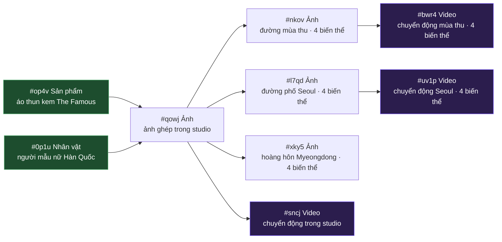

<p align="center">
  
</p>

<p align="center">
  <a href="#license"></a>
  
  
  
  
  
  
  
  
  
  
  
  
</p>

---

<p align="center">
  <b>Một không gian làm việc dạng bảng vẽ vô hạn, chỉ chạy trên máy bạn, phục vụ quy trình tạo nội dung bằng AI.</b><br/>
  Ghép các nhân vật, sản phẩm, bối cảnh và video thành một "sơ đồ" có hướng đi. Mọi thao tác tạo ảnh/video đều đi qua một tiện ích Chrome, tiện ích này sẽ nói chuyện với Google Flow (Veo 3.1 / GEM_PIX_2) thay cho bạn.<br/>
  Mỗi ô (node) đều có thể dùng lại, mỗi đường nối (edge) là một mối liên hệ dữ liệu thật, mỗi phiên bản đều có thể tạo lại độc lập.
</p>

> **⚠ Yêu cầu bắt buộc — đọc phần này trước khi cài đặt:**
>
> 1. **Gói Google Flow: chỉ dùng được gói `Pro` hoặc `Ultra`.** Tính năng tạo video Veo 3.1 i2v và ảnh GEM_PIX_2 chỉ mở cho tài khoản trả phí. Tài khoản miễn phí và tài khoản dùng thử không chạy được chức năng tạo video, nên Flowboard sẽ không hoạt động trên đó. Vui lòng kiểm tra gói của bạn tại [labs.google/fx](https://labs.google/fx/tools/flow) trước khi cài.
> 2. **Bắt buộc phải cài tiện ích Chrome.** Mọi yêu cầu tạo ảnh/video đều được chuyển tiếp qua thư mục `extension/` (Chrome MV3) để chương trình có thể dùng phiên đăng nhập Flow + mã reCAPTCHA của bạn. Nếu chưa cài tiện ích và chưa kết nối với `labs.google/fx/tools/flow`, nút `▶ Generate` sẽ không hoạt động.
> 3. **Cần có ít nhất một CLI LLM trong `PATH`** để dùng tính năng tự viết prompt / xem ảnh / lập kế hoạch. Flowboard có sẵn lớp chuyển đổi nhà cung cấp — bạn chọn trong `Settings → AI Providers`:
>
>    - **Claude Code** (mặc định, khuyên dùng) —
>      [`@anthropic-ai/claude-code`](https://docs.claude.com/claude-code/install) ·
>      Đăng nhập bằng tài khoản Claude của bạn · đã chạy thử kỹ.
>    - **Gemini CLI** — [`@google/gemini-cli`](https://github.com/google-gemini/gemini-cli) ·
>      Đăng nhập bằng tài khoản Google AI · đã chạy thử; mỗi lần gọi chậm hơn Claude khoảng 15 giây vì phải khởi động tiến trình con.
>    - **OpenAI Codex** —
>      [`@openai/codex`](https://github.com/openai/codex) · Đăng nhập bằng tài khoản ChatGPT Plus/Pro · đã viết mã cho lớp nhà cung cấp + tự phát hiện, nhưng **chưa chạy thử đầu cuối**; coi như bản beta.
>
>    Flowboard không gọi thẳng đến bất kỳ API LLM đám mây nào — mọi vòng gọi tự viết prompt / xem ảnh / lập kế hoạch đều gọi qua CLI bạn đã cài, nên chi phí sẽ nằm trên gói AI bạn đang trả.

<p align="center">
  <a href="#tai-sao-can-flowboard">Tại sao cần Flowboard</a> ·
  <a href="#minh-hoa">Minh họa</a> ·
  <a href="#flowboard-hoat-dong-the-nao">Flowboard hoạt động thế nào</a> ·
  <a href="#kien-truc-tong-the">Kiến trúc tổng thể</a> ·
  <a href="#huong-dan-cai-dat-nhanh">Hướng dẫn cài đặt nhanh</a> ·
  <a href="#cac-tinh-nang-chinh">Các tính năng chính</a>
</p>

---

## Demo

<p align="center">
  <a href="docs/assets/flowboard-intro.mp4">
    
  </a><br/>
  <sub>Video demo đầy đủ: từ ảnh tham chiếu → ảnh ghép → nhiều video từ nhiều nguồn. Bấm vào để xem bản MP4 chất lượng cao.</sub>
</p>

---

## Tại sao cần Flowboard

Khi làm video quảng cáo cho thương mại điện tử, công việc thường lặp đi lặp lại: cùng một người mẫu, cùng một sản phẩm, nhưng phải tạo ra nhiều bối cảnh, nhiều đoạn clip ngắn khác nhau. Nếu làm thủ công trên giao diện Veo / Imagen thông thường, bạn sẽ phải tải lại cùng một ảnh tham chiếu nhân vật, gõ lại cùng một mô tả kiểu "cô gái Hàn Quốc trẻ mặc áo thun kem croptop", và rất dễ quên mất phiên bản 4 ảnh kia sinh ra từ ảnh gốc nào.

Flowboard biến quy trình này thành một **sơ đồ** trực quan:

- **Ảnh tham chiếu là các ô trên sơ đồ** — tải ảnh nhân vật lên một lần, tải ảnh sản phẩm lên một lần.
- **Bức ảnh ghép là một ô** — `(Nhân vật) + (Sản phẩm) → Ảnh`.
- **Video là một ô** — `(Ảnh) → Video` thông qua i2v, có thể tạo hàng loạt: ảnh gốc có 4 phiên bản thì tạo ra 4 video chỉ với một cú bấm.
- **Prompt (câu mô tả) được AI tự soạn** dựa trên các ảnh phía trên (LLM có cấu hình vision sẽ mô tả từng ảnh tham chiếu → phần generator phía dưới ghép vào prompt theo phong cách tạp chí thời trang). Bạn có thể đổi nhà cung cấp AI trong `Settings → AI Providers`; mặc định là Claude Code.

Kết quả: chỉ cần một bảng vẽ duy nhất là bạn quản lý được cả một chiến dịch.

---

## Minh họa

Sơ đồ bên dưới là bản xuất thật từ một bảng vẽ trong dự án — hai ô tham chiếu (`#op4v` sản phẩm, `#0p1u` người mẫu) cung cấp dữ liệu cho ba ảnh ghép và ba video phía dưới. Mọi ảnh và clip bạn thấy đều được tạo ra bởi chính quy trình trong repo này.

<p align="center">
  <br/>
  <sub>Bảng vẽ thật trong ứng dụng: 2 ô tham chiếu (bên trái) → ảnh ghép trong studio <code>#qowj</code> (ở giữa) → ảnh biến thể bối cảnh (mùa thu / Seoul / Myeongdong) → 3 ô video với 4 biến thể i2v mỗi ô (bên phải).</sub>
</p>



### Tầng 0 — ảnh tham chiếu (thiết lập một lần)

<table>
<tr>
<td align="center" width="50%">
  <br/>
  <sub><b>#op4v · Sản phẩm</b><br/>Áo thun cổ tròn tay ngắn, màu kem, chất liệu cotton gân, thêu chữ "The Famous" màu nâu ở giữa ngực.</sub>
</td>
<td align="center" width="50%">
  <br/>
  <sub><b>#0p1u · Nhân vật</b><br/>Ảnh chụp chân dung trong studio, biểu cảm trung tính, miệng khép — được tạo từ các mẫu giới tính + quốc tịch, dùng làm "neo" để giữ nhất quán danh tính cho mọi ảnh/video phía sau.</sub>
</td>
</tr>
</table>

### Tầng 1 — ảnh ghép trong studio

<p align="center">
  <br/>
  <sub><b>#qowj · Ảnh</b> — prompt tự soạn từ các mô tả phía trên: "Ảnh tạp chí, người mẫu nhìn thẳng vào ống kính, cả hai tay đút túi quần, khung hình từ đầu gối trở lên, nền studio trung tính." Tạo 4 biến thể tư thế khác nhau trong cùng một lượt.</sub>
</p>

### Tầng 2 — biến thể theo bối cảnh

Hệ thống tự nhận diện bối cảnh từ mô tả của mỗi ảnh mới và chuyển đổi "từ vựng chuyển động" tương ứng (đường phố / studio / quán cà phê / ngoài trời). Cùng một nhân vật, cùng một sản phẩm, nhưng ở ba thế giới khác nhau:

<table>
<tr>
<td align="center" width="33%">
  <br/>
  <sub><b>#nkov</b> · con đường núi mùa thu, đình truyền thống Hàn Quốc, lá phong đỏ</sub>
</td>
<td align="center" width="33%">
  <br/>
  <sub><b>#l7qd</b> · đường phố Seoul, xe đẩy thức ăn, biển hiệu Hàn Quốc</sub>
</td>
<td align="center" width="33%">
  <br/>
  <sub><b>#xky5</b> · hoàng hôn ở Myeongdong, quán có mái che đỏ, biển hiệu Olive Young</sub>
</td>
</tr>
</table>

### Tầng 3 — tạo video từ ảnh (Veo 3.1 i2v)

Máy quay được giữ cố định (đây là mặc định cho thương mại điện tử — đảm bảo sản phẩm luôn nằm trọn trong khung hình); người mẫu sẽ thực hiện một chuỗi **2–3 động tác tạp chí** trong vòng 8 giây. (GitHub chỉ hiển thị MP4 khi file nằm trên CDN của họ, nên trong README mình dùng GIF lặp — bản MP4 chất lượng cao nằm trong [`docs/assets/`](docs/assets/).)

<table>
<tr>
<td align="center" width="33%">
  <br/>
  <sub><b>#sncj</b> · chuyển động trong studio · bước nhẹ → liếc → vuốt tóc<br/><a href="docs/assets/video-base.mp4">▶ MP4</a></sub>
</td>
<td align="center" width="33%">
  <br/>
  <sub><b>#bwr4</b> · đường mùa thu · xoay người → tay vào túi → cười nhẹ với máy quay<br/><a href="docs/assets/video-autumn.mp4">▶ MP4</a></sub>
</td>
<td align="center" width="33%">
  <br/>
  <sub><b>#uv1p</b> · ánh sáng ban ngày Seoul · bước nhẹ → ngoái nhìn qua vai → tay vào túi<br/><a href="docs/assets/video-seoul.mp4">▶ MP4</a></sub>
</td>
</tr>
</table>

> Cả ba video đều được tạo chỉ với một cú bấm: hệ thống đọc `aiBrief` của ảnh gốc, chọn bộ động tác phù hợp với bối cảnh, và khóa máy quay để áo thun vẫn nằm trọn trong khung hình xuyên suốt clip.

---

## Flowboard hoạt động thế nào

Hãy đọc phần này một lần, phần còn lại của giao diện sẽ rất dễ hiểu.

### 1. Ảnh tham chiếu là các ô bạn thiết lập một lần

Có hai loại ô đóng vai trò **neo** cho toàn bộ sơ đồ:

| Ô | Mục đích | Cách tạo |
|------|---------|-----------------|
| **Nhân vật** | Một người mà bạn muốn giữ nguyên danh tính xuyên suốt nhiều ảnh. | Tạo từ các mẫu giới tính + quốc tịch (Nam / Nữ × VN / JP / KR / CN / TH / US / FR), hoặc tải ảnh chân dung của bạn lên. Hệ thống sẽ tự động neo về ảnh chụp thẳng, miệng khép, biểu cảm trung tính — vì Veo i2v không giữ được danh tính ổn định nếu ảnh gốc cười hở răng. |
| **Sản phẩm** | Sản phẩm / trang phục / đồ vật cần xuất hiện trong các bối cảnh. | Tải lên (từ máy hoặc từ URL) hoặc tạo bằng prompt. Có nút `Refine` ngay trong ô để chỉnh sửa bằng Flow `edit_image` mà không làm mất ảnh gốc. |

Mỗi ô tham chiếu sẽ tự động có một `aiBrief` (LLM có cấu hình vision sẽ mô tả ảnh một lần, lưu mô tả lại trên ô). Khi tạo ảnh/video phía sau, hệ thống sẽ tự đi ngược lên trên, lấy hết các mô tả này làm ngữ cảnh. Bạn có thể tắt trong `Settings → AI Providers` nếu muốn tự gõ prompt.

### 2. Ghép ảnh chỉ đơn giản là nối các ô

Để tạo một ảnh ghép, bạn thả một ô **Ảnh** vào sơ đồ rồi nối các ô tham chiếu phía trên vào nó. Bấm `Generate` (hoặc nhấn Enter khi để trống ô prompt):

```
[Nhân vật #ujr1]  ───►
                        \
[Sản phẩm #sqpi]  ───► [Ảnh #đích]
                        /
[Ảnh #khác]       ───►
```

Mọi `mediaId` phía trên sẽ được gửi cho Flow dưới dạng đầu vào kiểu `IMAGE_INPUT_TYPE_REFERENCE`. Khi bạn yêu cầu nhiều biến thể, hệ thống tự soạn prompt (`/api/prompt/auto-batch`) sẽ nhờ LLM tạo **N câu prompt khác tư thế** trong cùng một lần gọi — nên 4 biến thể sẽ không bị trùng vào một kiểu "tay chống hông". Prompt mặc định theo phong cách tạp chí thời trang: nhìn thẳng, miệng khép trung tính, góc ba phần tư, tay hướng về trang phục, khung hình từ đầu gối trở lên.

### 3. Từ Ảnh sang Video bằng Veo i2v

Một ô **Video** nhận đầu vào là một ô Ảnh phía trên. Nối xong, bấm `Generate`, chọn:

- **Camera** = `Tĩnh` (mặc định, an toàn cho thương mại điện tử — khung hình khóa cứng, không zoom, không lia, sản phẩm không bao giờ bị cắt) hoặc `Động` (hệ thống tự chọn dolly / lia / micro-shift phù hợp với bối cảnh).
- **Biến thể nguồn** = tích từng biến thể phía trên + có nút `Tất cả / Bỏ chọn` để thao tác nhanh. Nếu ảnh phía trên có 4 biến thể và bạn tích cả 4, hệ thống sẽ gửi **một yêu cầu i2v cho mỗi biến thể** trong cùng một lần gọi Flow — 4 ảnh gốc → 4 video khác nhau.

Phần tạo chuyển động dùng các mốc thời gian (`0–3s: …`, `3–6s: …`, `6–8s: …`) để mô hình thực hiện một chuỗi động tác tạp chí trong clip 8 giây — không bao giờ đứng hình, không bao giờ cười hở miệng.

### 4. Prompt tự soạn nhận biết bối cảnh

Hệ thống đọc `aiBrief` của ảnh nguồn và chuyển đổi "từ vựng chuyển động" tùy theo bối cảnh:

| Loại bối cảnh | Từ vựng chuyển động |
|------------|-------------|
| Studio / nền trơn | tay chống hông, vuốt tay áo, nghiêng đầu, nhìn vào ống kính |
| Đường phố / thành phố / vỉa hè | bước nhẹ về phía trước, vuốt tóc, ngoái nhìn qua vai, tay vào túi, cười nhẹ |
| Quán cà phê / trong nhà | nhấp một ngụm, ngả người ra sau, liếc nhìn ra cửa sổ |
| Bãi biển / thiên nhiên / ngoài trời | tóc bay trong gió, thở nhẹ, nhìn về phía đường chân trời |

Ảnh chụp studio thì được tạo động tác tạp chí, ảnh chụp đường phố New York thì được tạo động tác đi bộ và liếc nhìn. Không cần viết thêm nhánh code nào — LLM nhận diện từ khóa và chọn đúng bộ từ vựng từ prompt hệ thống.

---

## Kiến trúc tổng thể

```
┌──────────────────────┐    ┌────────────────────┐    ┌──────────────────────┐
│  Tiện ích Chrome MV3 │◄───┤  Agent FastAPI     ├───►│  SQLite (storage/)   │
│  - content script    │ WS │  127.0.0.1:8101    │    │  Board, Node, Edge,  │
│  - injected MAIN     │ ws │  + hàng đợi worker │    │  Request, Asset,     │
│  - cho phép CDN URL  │9223│  + WS server :9223 │    │  Plan, ChatMessage,  │
│  - cầu nối Captcha   │    │  + cầu nối LLM CLI │    │  BoardFlowProject    │
└──────────────────────┘    └─────────┬──────────┘    └──────────────────────┘
        ▲                             │
        │                             ▼
        │                   ┌────────────────────┐
        └───── Google Flow  │  React + Vite      │
              labs.google   │  Canvas ReactFlow  │
              (i2v / ảnh)   │  Store Zustand     │
                            │  127.0.0.1:5173    │
                            └────────────────────┘
```

- **Giao diện web** — Vite + React 18 + ReactFlow 12 + Zustand 5 + TypeScript ở chế độ nghiêm ngặt. Vẽ bảng vẽ vô hạn, các hộp thoại, thanh bên. Không gọi thẳng đến Google Flow.
- **Agent** — FastAPI + SQLModel + SQLite. Quản lý trạng thái bảng vẽ, chạy một hàng đợi worker trong cùng tiến trình để chuyển tiếp mọi yêu cầu tạo ảnh/video qua tiện ích Chrome, và gọi LLM CLI bạn đã cấu hình (Claude / Gemini / Codex — xem *AI Providers* bên dưới) để xem ảnh + tự soạn prompt + lập kế hoạch.
- **Tiện ích Chrome** — Chrome MV3. Chạy trên trang `labs.google/fx/tools/flow`, chặn các lệnh gọi API của Flow (chạy ở "MAIN world" để lấy mã reCAPTCHA), chuyển tiếp qua WebSocket loopback để agent không cần đụng đến cookie trình duyệt.
- **Lưu trữ** — chỉ trên máy bạn. SQLite cho sơ đồ + lịch sử, thư mục `storage/media/` để cache ảnh/video (tải lười từ các URL có chữ ký của Flow và phát lại từ agent để không bị hết hạn sau 1 giờ).

---

## Hướng dẫn cài đặt nhanh

### Yêu cầu

| Phần mềm cần có | Lý do |
|------------|-----|
| **Python 3.11** | Môi trường chạy agent (FastAPI + SQLModel) |
| **Node 20 trở lên** | Máy chủ phát triển giao diện web (Vite) |
| **Chrome / Chromium** | **Bắt buộc** — chứa tiện ích MV3 để chuyển tiếp mọi lệnh gọi Google Flow. Agent không có cách nào nói chuyện với Flow nếu không có tiện ích. |
| **Một CLI LLM** trong `PATH` | Để mô tả ảnh + tự soạn prompt + lập kế hoạch. Chọn một — mặc định là **Claude Code** ([`@anthropic-ai/claude-code`](https://docs.claude.com/claude-code/install)); cũng hỗ trợ **Gemini CLI** ([`@google/gemini-cli`](https://github.com/google-gemini/gemini-cli)) và **OpenAI Codex** ([`@openai/codex`](https://github.com/openai/codex), đã viết mã nhưng chưa chạy thử). Tất cả đều đăng nhập bằng gói AI bạn đang trả — không cần thêm khóa API. |
| **Gói Google Flow `Pro` hoặc `Ultra`** tại [`labs.google/fx/tools/flow`](https://labs.google/fx/tools/flow) | **Gói miễn phí và tài khoản dùng thử sẽ không chạy được.** Tính năng tạo video Veo 3.1 i2v + tạo ảnh GEM_PIX_2 chỉ mở cho gói trả phí. |

> **Trên Windows:** Dùng [WSL2](https://learn.microsoft.com/en-us/windows/wsl/install). Mọi lệnh bên dưới giả định bạn đang dùng shell Unix.

### Cài đặt nhanh bằng một dòng (tùy chọn)

Nếu bạn đã cài `make`, repo có sẵn các lệnh tắt gom Bước 2 + 3:

```bash
make install        # cài venv cho agent + gói cho frontend (ưu tiên uv, không có thì dùng pip)
make install-dev    # giống trên, kèm thêm ruff + pytest
make update         # nâng cấp gói của agent + frontend tại chỗ
make agent          # chạy FastAPI ở cổng :8101
make frontend       # chạy Vite ở cổng :5173
```

`uv` sẽ được tự phát hiện (cài nhanh hơn ~10 lần). Cài một lần bằng `curl -LsSf https://astral.sh/uv/install.sh | sh`, hoặc bỏ qua thì Makefile sẽ tự dùng `venv` + `pip` chuẩn. Riêng Bước 1 (cài tiện ích Chrome) vẫn phải làm thủ công.

### Bước 1 — cài tiện ích Chrome

```bash
git clone https://github.com/<your-fork>/flowboard.git
cd flowboard
```

1. Mở `chrome://extensions/` → bật **Chế độ nhà phát triển** (góc trên bên phải).
2. Bấm **Tải tiện ích đã giải nén** → chọn thư mục `extension/` trong repo này.
3. Mở một tab đến <https://labs.google/fx/tools/flow> và đăng nhập.
4. Biểu tượng tiện ích sẽ chuyển sang màu khi nó lấy được mã đăng nhập Flow mới (khoảng 5 giây).

### Bước 2 — khởi động agent

```bash
cd agent
python3.11 -m venv .venv
.venv/bin/pip install -r requirements.txt

# `--timeout-graceful-shutdown 2` giúp `--reload` phản hồi nhanh khi bạn lưu file Python
# — nếu thiếu, uvicorn sẽ chờ mãi WebSocket đóng.
.venv/bin/uvicorn flowboard.main:app --reload --port 8101 \
  --timeout-graceful-shutdown 2
```

Kiểm tra nhanh:

```bash
curl http://127.0.0.1:8101/api/health
# {"ok":true,"extension_connected":true,"ws_stats":{"connected":true,"flow_key_present":true,...}}
```

### Bước 3 — khởi động giao diện web

```bash
cd frontend
npm install
npm run dev
# → http://localhost:5173
```

Mở đường dẫn trên. Bảng vẽ đầu tiên ("Chưa đặt tên") sẽ tự tạo nếu cơ sở dữ liệu còn trống. Thêm ô Nhân vật, tạo ảnh, thêm ô Sản phẩm, thêm ô Ảnh, nối các ô lại, bấm **▶ Generate** — toàn bộ demo ở trên chỉ mất khoảng 15 phút thao tác.

### Chạy bộ kiểm thử

```bash
# Agent
cd agent && .venv/bin/python -m pytest -q
# 333 passed

# Frontend
cd frontend && npx tsc -p . --noEmit && npx vite build
```

---

## Các tính năng chính

### Các ô kiểu tham chiếu

- **Nhân vật** — tạo từ các nút mẫu giới tính + quốc tịch, hoặc tải ảnh chân dung của bạn lên. Luôn được neo về ảnh chụp thẳng, miệng khép, biểu cảm trung tính để Veo i2v giữ nhất quán danh tính xuyên suốt mọi clip phía sau.
- **Sản phẩm** — tải lên (từ máy hoặc URL) hoặc tạo bằng prompt. Có thể chỉnh sửa tại chỗ bằng một prompt khác (Flow `edit_image`, giữ nguyên `BASE_IMAGE`, có thể kèm danh sách tham chiếu).

### Các ô ghép nội dung

- **Ảnh** — nhận nhiều ảnh tham chiếu. Nối bao nhiêu nhân vật, sản phẩm hoặc ảnh khác cũng được; tất cả sẽ được gửi cho Flow dưới dạng `IMAGE_INPUT_TYPE_REFERENCE`.
  - 1–4 biến thể mỗi lần tạo, mỗi biến thể có một prompt tư thế khác nhau (LLM xoay vòng qua bộ 8 tư thế cho mỗi biến thể — không bao giờ có hai biến thể "tay chống hông" trong cùng một lần tạo).
  - Tỉ lệ ảnh mặc định kế thừa từ ô phía trên; nếu các ô phía trên có tỉ lệ khác nhau thì rơi về 9:16.
- **Storyboard** — chuỗi 1–8 cảnh kể chuyện trong cùng một ô. LLM lập kế hoạch sẽ sinh prompt cho từng cảnh VÀ một cây liên tục: mỗi cảnh sẽ tự khai báo là bắt đầu mới (`gen_image`) hay nối tiếp cảnh trước (`edit_image` từ `mediaId` của cảnh đó). Các cảnh bắt đầu chạy song song theo lô 4; các cảnh nối tiếp đi theo cây, các cảnh cùng cấp chạy song song. Tham chiếu từ các ô phía trên áp dụng cho mọi cảnh. Cảnh bị lỗi giữ trạng thái `partial` và có thể thử lại từng ô; các cảnh phụ thuộc sẽ hiện biểu tượng 🔒 cho đến khi cảnh cha thử lại thành công. Phù hợp với chuỗi "mở hộp → thử đồ → đi chơi", chuỗi bối cảnh, danh sách cảnh quay thương mại điện tử.
- **Video** — tạo video từ ảnh bằng Veo. **i2v đa nguồn**: một ảnh phía trên có 4 biến thể sẽ tạo ra một đợt gồm một video cho mỗi biến thể → một video cho mỗi nguồn. Hoặc chọn một tập con (tích/bỏ tích từng biến thể + có nút `Tất cả / Bỏ chọn`).
  - Camera = `Tĩnh` (khung hình khóa, mặc định cho thương mại điện tử) hoặc `Động` (hệ thống tự chọn dolly / lia / micro-shift phù hợp với bối cảnh).
  - Phần tạo chuyển động dùng các mốc thời gian để mô hình thực hiện chuỗi 2–3 động tác tạp chí trong clip 8 giây — không bao giờ đứng hình.

### Tự soạn prompt

- Vision sẽ mô tả mỗi tài sản mới (dùng đường dẫn đính kèm đa phương thức của CLI đã cấu hình — `@<path>` cho Claude / Gemini, `--image` cho Codex khi có) → lưu thành `aiBrief` trên ô.
- Khi tạo ảnh/video phía dưới mà để trống prompt → `/api/prompt/auto` đi ngược lên các cạnh phía trên, thu thập các mô tả, nhờ LLM soạn một prompt phù hợp với bối cảnh và làm nổi sản phẩm.
- Khi tạo nhiều biến thể, `/api/prompt/auto-batch` trả về N prompt tư thế khác nhau trong cùng một lần gọi LLM.
- **Bật/tắt Vision** trong `Settings → AI Providers`: khi TẮT, hệ thống tự soạn sẽ dùng prompt bạn gõ tay trên từng ô tham chiếu thay vì dùng mô tả do vision tạo. Đường dẫn tải lên thủ công vẫn tự chạy vision (vì bạn đã cố ý thêm ảnh) — chỉ phần tự điền prompt khi tạo mới là bị ảnh hưởng.

### Nhiều nhà cung cấp AI (multi-LLM)

Một nhãn **🤖 Provider** ở góc trên bên phải thanh công cụ sẽ mở hộp thoại để bạn đổi LLM nào đang điều khiển Flowboard. Một nhà cung cấp phụ trách cả ba tính năng (Tự soạn prompt / Vision / Lập kế hoạch) — đổi một lần, không phải ba. Có nút kiểm thử cho từng tính năng và nút **Apply changes** chỉ sáng khi cả ba kiểm thử đều xanh, để bạn không lỡ đổi sang một lựa chọn đang lỗi im lặng.

| Nhà cung cấp | Cách đăng nhập | Trạng thái |
|---|---|---|
| **Claude Code** | OAuth qua CLI `claude` · đăng nhập trên trang Anthropic | ✅ Mặc định · đã chạy thử kỹ |
| **Gemini CLI** | OAuth qua CLI `gemini` · gói Google AI Ultra | ✅ Đã chạy thử · chậm hơn Claude ~15 giây |
| **OpenAI Codex** | OAuth qua CLI `codex` · ChatGPT Plus/Pro | ⚠ Đã viết mã nhưng chưa chạy thử |

Phía backend có sẵn lớp nhà cung cấp Grok REST cho người dùng thích sửa trực tiếp `~/.flowboard/secrets.json`, nhưng giao diện không hiển thị vì xAI chưa ra mắt CLI cho người dùng cuối.

### Nhật ký hoạt động

Một biểu tượng **🔔 chuông** nằm trên thanh công cụ cạnh nhãn AI Provider. Bấm vào để xem mọi thao tác backend theo thứ tự thời gian mới nhất: tạo ảnh / tạo video / sửa ảnh / tự soạn prompt / vision / lập kế hoạch — mỗi mục có nhãn trạng thái (✓ xong · ⟳ đang chạy · ✗ lỗi) và thời lượng chạy. Bấm vào một dòng để mở cửa sổ chi tiết với đầy đủ tham số đầu vào, kết quả đầu ra, JSON lỗi (có nút sao chép), để bạn chẩn đoán lỗi mà không cần mở log của agent.

Huy hiệu trên chuông đếm số mục đang chạy + số mục lỗi gần đây chưa đọc, có viền đỏ khi có lỗi chưa đọc. Tự động làm mới mỗi 5 giây khi danh sách đang mở, 30 giây khi đóng, và tạm dừng khi tab không được mở.

### Trải nghiệm làm việc

- **Thêm ô nhanh** — thả từ bảng chọn ô vào vị trí bất kỳ với `Image` / `Video` thêm nhanh → tạo ô mới + tự nối cạnh.
- **Sửa cạnh dễ dàng** — bấm vào một cạnh để chọn (viền sáng + phát sáng), nhấn Backspace / Delete để xóa. Có vùng bắt chuột trong suốt 24 px để dễ nắm.
- **Sao chép biến thể** — nút `New variant +` trong trình xem kết quả sẽ tạo một ô anh em với cùng kết nối phía trên, điền sẵn prompt, mở hộp thoại tạo ảnh.
- **Thanh bên dự án** — nhiều bảng vẽ trong cùng một agent, mỗi bảng có ánh xạ dự án Flow riêng. Đổi tên / xóa có lan truyền (xóa luôn các hàng con: ô, cạnh, yêu cầu, tài sản, kế hoạch, lượt chạy).

---

## Cấu trúc thư mục

```
agent/                  Dịch vụ FastAPI (Python 3.11)
  flowboard/
    routes/             Các điểm cuối HTTP (boards, nodes, edges, requests,
                        upload, vision, prompt, plans, llm, activity, …)
    services/           SDK Flow, bộ soạn prompt, mô tả ảnh,
                        bộ thực thi pipeline, ghi nhật ký hoạt động
      llm/              Lớp nhiều nhà cung cấp LLM (registry, secrets,
                        Claude / Gemini / OpenAI Codex / Grok)
      claude_cli.py     Chi tiết tiến trình con của ClaudeProvider
    worker/             Hàng đợi trong tiến trình (gen_image, gen_video,
                        edit_image, upload_image)
    db/                 Định nghĩa SQLModel
  tests/                Hơn 333 bài kiểm thử pytest

frontend/               Vite + React + ReactFlow
  src/
    canvas/             Board.tsx, NodeCard.tsx, AddNodePalette.tsx
    components/
      activity/         ActivityBell + danh sách thả xuống + cửa sổ chi tiết
      settings/         AiProvidersSection + ProviderCard + cửa sổ cài đặt
      AiProviderBadge.tsx · AiProviderDialog.tsx · GenerationDialog · ResultViewer · ProjectSidebar · ChatSidebar · Toolbar · Toaster
    store/              Zustand: board, generation, pipeline, settings
    api/                client.ts, autoBrief.ts

extension/              Chrome MV3 (content script + injected MAIN)
docs/                   Tài sản tĩnh (README này, ảnh chụp, media demo)
storage/                Bộ nhớ đệm cục bộ + SQLite (đã thêm vào .gitignore)
```

---

## Trạng thái dự án

Công cụ cá nhân, chỉ chạy trên máy. **333 / 333 bài kiểm thử đều pass** (agent), tsc sạch (frontend). Lưu ý:

- ⚠ **Gói Google Flow bắt buộc là `Pro` hoặc `Ultra`.** Gói miễn phí và tài khoản dùng thử không có quyền truy cập Veo 3.1 i2v / GEM_PIX_2 — mọi lệnh tạo sẽ thất bại.
- ⚠ **Phải cài và kết nối tiện ích Chrome.** Agent không nói chuyện trực tiếp với Flow — mọi yêu cầu i2v / ảnh / sửa ảnh đều được chuyển tiếp qua `extension/` qua WebSocket loopback. Không có tiện ích → không tạo được.
- ⚠ WebSocket có bảo vệ HMAC (`X-Callback-Secret` được tạo mỗi lần agent khởi động) — chỉ chạy loopback, không dành cho nhiều người dùng.
- ⚠ Giới hạn tốc độ của Google Flow vẫn áp dụng trong gói trả phí của bạn.
- ⚠ Bộ lọc nội dung của Veo / Imagen (`PUBLIC_ERROR_PROMINENT_PEOPLE_FILTER_FAILED`, `PUBLIC_ERROR_AUDIO_FILTERED`, `PUBLIC_ERROR_UNSAFE_GENERATION`) — hiển thị nguyên văn trong nhật ký hoạt động + lỗi yêu cầu thất bại để bạn tự chẩn đoán / thử lại. Khi prompt bị Google xóa ở dispatch stage (mọi poll `/v1/media/<id>` trả `404 NOT_FOUND`), worker tự động bỏ cuộc sau 3 lần liên tiếp (~30 giây) thay vì chờ hết 5 phút, và thông báo lỗi tiếng Việt trong nhật ký: *"Google đã xóa video vì prompt vi phạm tiêu chuẩn cộng đồng"*.
- ⚠ Tính năng tự soạn prompt + vision + lập kế hoạch cần **một** CLI LLM trong `PATH` (khuyên dùng Claude Code; đã thử với Gemini CLI; OpenAI Codex đã viết mã nhưng chưa chạy thử). Nếu không có CLI nào, nút `Generate` vẫn hoạt động nếu bạn tự gõ prompt — chỉ có đường tự điền khi để trống là không dùng được.

## Liên quan

- [`crisng95/flowkit`](https://github.com/crisng95/flowkit) — cùng cách dùng tiện ích Chrome làm cầu nối với Google Flow, nhưng dành cho **video truyện YouTube** (nhiều cảnh, lời dẫn, ảnh bìa). Flowboard mượn kiến trúc cầu nối này.

## Vận hành

- **Cài như background service (macOS)**: tự khởi động khi login, tự restart khi crash, không cần mở terminal — xem [`docs/BACKGROUND-SERVICE.md`](docs/BACKGROUND-SERVICE.md). Venv tự động tạo ở `~/.flowboard/agent-venv` (system disk — launchd không đọc được `.venv` mới tạo trên ổ ngoài).
- **Quy trình phát triển**: `bin/flowboard dev` (foreground, `--reload`) cho backend; `npm run dev` ở terminal 2 cho HMR React; sửa extension thì reload ở `chrome://extensions`.

## Giấy phép

MIT (dự kiến — file giấy phép đang chờ bổ sung).

---

## Ghi công

Mọi ảnh/video trong README này được tạo ra thông qua quy trình sử dụng [Google Flow](https://labs.google/flow). Phần tự soạn prompt + mô tả ảnh mặc định dùng [Claude](https://claude.ai) qua CLI cục bộ; hỗ trợ nhiều LLM bổ sung thêm [Gemini CLI](https://github.com/google-gemini/gemini-cli) của Google và [Codex CLI](https://github.com/openai/codex) của OpenAI — chọn một trong `Settings → AI Providers`.

---

## Cộng đồng & Hỗ trợ

<p align="center">
  <a href="https://www.facebook.com/groups/flowkit.flowboard.community">
    
  </a>
</p>

Cộng đồng chung cho cả **FlowKit** và **Flowboard**. Bạn có thể:

- Đăng các ảnh và clip bạn đã tạo
- Chia sẻ các mẫu sơ đồ, bộ vibe và công thức prompt hiệu quả với bạn
- Nhờ giúp khi kết quả chưa đúng ý bạn
- Đề xuất tính năng và báo lỗi bạn gặp phải
- Trao đổi mẹo về giới hạn gói Google Flow, hành vi Veo i2v và cách cài đặt LLM CLI (Claude / Gemini / Codex)

→ **[facebook.com/groups/flowkit.flowboard.community](https://www.facebook.com/groups/flowkit.flowboard.community)**
